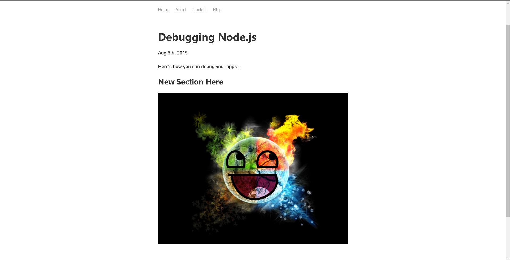

# gatsbypractice
> simple app i did to learn a little bit of Gatsby

Netlify deployed app using a contentful CMS to render blog posts.  Also uses a number of plugins available from Gatsby including the gatsby-plugin-scss and a few image plugins.  Learned about SEO in the process.  Also learned to use GraphQL and how to update graphql to render playground instead of the default interface.

Link to deployed project https://modest-archimedes-36f35e.netlify.com/
